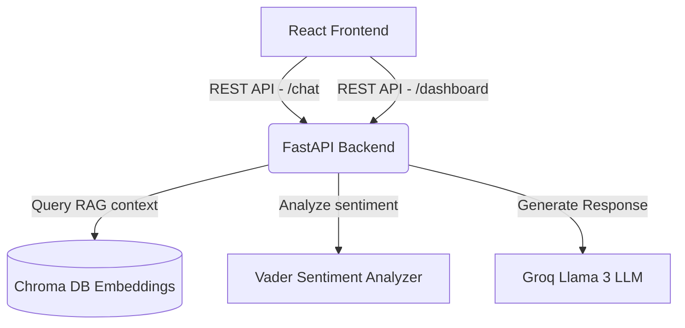

# Arundhati Health - RAG Student Wellness Chatbot

Arundhati Health is an empathetic, AI-powered student wellness and medical support assistant. It uses a **Retrieval-Augmented Generation (RAG)** pipeline to fetch context-specific health guidance, logs user symptoms dynamically, and compiles them into a live wellness dashboard.

---

## 🌟 Key Features

*   **Empathetic AI Chatbot**: Real-time streaming responses powered by **Groq (Llama 3)**, styled with rich glassmorphism UI/UX base.
*   **Robust Text-to-Speech (TTS)**: Built-in voice controls (Play `▶`, Pause `⏸`, Resume `▶`, and Stop `⏹`) using a custom sentence-level queuing engine that bypasses browser speechSynthesis timeout bugs.
*   **Live Wellness Dashboard**: Polled dynamically every 3 seconds to track total messages, mood sentiment (Positive vs. Negative), and symptom mentions (Stress, Headaches, Sleep issues).
*   **AI-Generated Health Insights**: Computes an overall wellness score and appends actionable wellness recommendations on the **Overview** page based on symptom occurrences.

---

## ⚙️ Project Architecture



---

## 🚀 Setup & Installation

### Prerequisites
*   **Python**: `3.9` to `3.11`
*   **Node.js**: `v18+` and **npm**
*   **Groq API Key**: Obtain from [Groq Console](https://console.groq.com/)

---

### 1. Backend Setup (FastAPI)

1.  **Navigate to the root directory** and create a Python virtual environment:
    ```bash
    python -m venv venv
    ```

2.  **Activate the virtual environment**:
    *   **Windows**:
        ```bash
        venv\Scripts\activate
        ```
    *   **Linux/macOS**:
        ```bash
        source venv/bin/activate
        ```

3.  **Install dependencies**:
    ```bash
    pip install -r requirements.txt
    ```

4.  **Configure environment variables**:
    Create a `.env` file in the root directory:
    ```ini
    PORT=8000
    GROQ_API_KEY=your_groq_api_key_here
    ```

5.  **Run the backend server**:
    ```bash
    python app.py
    ```
    The backend server will run on [http://127.0.0.1:8000](http://127.0.0.1:8000).

---

### 2. Frontend Setup (React)

1.  **Navigate to the frontend folder**:
    ```bash
    cd frontend
    ```

2.  **Install npm packages**:
    ```bash
    npm install
    ```

3.  **Run the development server**:
    *   **Windows (PowerShell)**:
        ```powershell
        $env:PORT=3001; $env:BROWSER='none'; npm start
        ```
    *   **Linux/macOS**:
        ```bash
        PORT=3001 BROWSER=none npm start
        ```
    The web application will open on [http://localhost:3001](http://localhost:3001).

---

## 📂 Codebase Overview

*   [`app.py`](app.py): The main FastAPI server containing the Chat endpoints, dashboard metrics calculations, sentiment analysis, and LLM prompt generation.
*   [`ingest.py`](ingest.py): Utility script to load source files, split texts, generate embeddings using Hugging Face Sentence Transformers, and save them in Chroma DB.
*   [`data/`](data/): Source health articles and manuals loaded by the RAG database.
*   [`frontend/src/components/InputBox.jsx`](frontend/src/components/InputBox.jsx): The main chat interface handler, containing voice input, send methods, and the custom sentence-level TTS queue controls.
*   [`frontend/src/pages/StudentDashboard.jsx`](frontend/src/pages/StudentDashboard.jsx): Recharts-powered analytics page showing sentiment pie charts, symptom occurrence bars, and overall health scores.
*   [`frontend/src/pages/StudentOverview.jsx`](frontend/src/pages/StudentOverview.jsx): Panel presenting custom medical and behavioral advice recommendations based on dynamic metrics.
